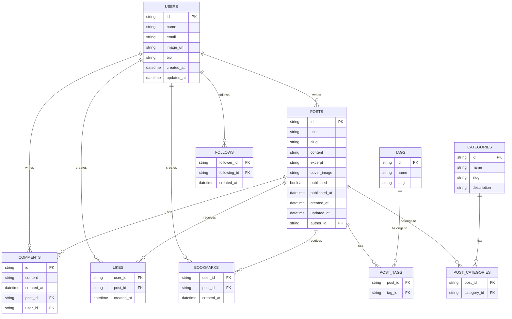

# Design Document: WriterFlow Platform

## Overview

WriterFlow is a full-stack blog platform built with Next.js, leveraging the App Router for optimal performance and SEO. The platform integrates Turso DB with Drizzle ORM for data persistence, Stack for authentication, and implements a rich text editor for content creation. The design focuses on creating a seamless user experience for both writers and readers, with emphasis on performance, SEO optimization, and a clean, intuitive interface.

The frontend UI components are already built, and this design focuses on implementing the backend functionality, database schema, API endpoints, and integrating a rich text editor. The system will follow a modular architecture with clear separation of concerns, making it maintainable and extensible.

## Architecture

### High-Level Architecture

The WriterFlow platform follows a modern full-stack architecture with the following key components:

1. **Frontend Layer**:
   - Next.js App Router for page routing and rendering
   - React components for UI elements
   - Client-side state management for user interactions
   - Server Components for data fetching and rendering

2. **API Layer**:
   - Next.js Server Actions for handling form submissions and data mutations
   - API Routes for external integrations and complex operations
   - Authentication middleware for protecting routes

3. **Data Layer**:
   - Turso DB for data storage
   - Drizzle ORM for database interactions
   - Data models and schema definitions

4. **Authentication Layer**:
   - Stack authentication service integration
   - JWT token management
   - Protected routes and middleware

5. **Storage Layer**:
   - Image and media storage
   - Content backup and versioning

### System Architecture Diagram


## Components and Interfaces

### Core Components

1. **Authentication Module**
   - Responsible for user registration, login, and session management
   - Integrates with Stack authentication service
   - Provides middleware for protected routes

2. **User Profile Module**
   - Manages user profile data and preferences
   - Handles profile image uploads and updates
   - Tracks user activity and engagement

3. **Blog Content Module**
   - Manages creation, editing, and deletion of blog posts
   - Handles content storage and retrieval
   - Implements versioning and draft management

4. **Rich Text Editor Component**
   - Provides WYSIWYG editing capabilities
   - Supports formatting, media embedding, and code snippets
   - Handles content serialization and deserialization

5. **Feed and Discovery Module**
   - Implements algorithms for content recommendation
   - Manages content categorization and tagging
   - Provides search functionality

6. **SEO Optimization Module**
   - Generates metadata for pages
   - Manages canonical URLs and sitemaps
   - Optimizes content for search engines

7. **Social Engagement Module**
   - Handles likes, comments, and bookmarks
   - Manages user following relationships
   - Provides notification system

### Component Interfaces

#### Authentication Module Interface

```typescript
interface AuthService {
  register(userData: UserRegistrationData): Promise<User>;
  login(credentials: LoginCredentials): Promise<Session>;
  logout(): Promise<void>;
  getCurrentUser(): Promise<User | null>;
  isAuthenticated(): Promise<boolean>;
  refreshToken(): Promise<Session>;
}

interface UserRegistrationData {
  name: string;
  email: string;
  password: string;
}

interface LoginCredentials {
  email: string;
  password: string;
}

interface Session {
  user: User;
  token: string;
  expiresAt: Date;
}
```

#### Blog Content Module Interface

```typescript
interface BlogService {
  createPost(post: BlogPostData): Promise<BlogPost>;
  updatePost(id: string, post: BlogPostData): Promise<BlogPost>;
  deletePost(id: string): Promise<void>;
  getPostById(id: string): Promise<BlogPost>;
  getPostBySlug(slug: string): Promise<BlogPost>;
  getPostsByAuthor(authorId: string): Promise<BlogPost[]>;
  getFeaturedPosts(): Promise<BlogPost[]>;
  getRecentPosts(limit: number): Promise<BlogPost[]>;
  saveDraft(post: BlogPostData): Promise<BlogPost>;
  publishDraft(id: string): Promise<BlogPost>;
}

interface BlogPostData {
  title: string;
  content: string;
  excerpt?: string;
  coverImage?: string;
  tags?: string[];
  categoryId?: string;
  published?: boolean;
  authorId: string;
}
```

#### Rich Text Editor Interface

```typescript
interface EditorProps {
  initialContent?: string;
  onChange: (content: string) => void;
  onSave?: () => void;
  readOnly?: boolean;
  placeholder?: string;
  toolbarOptions?: ToolbarOption[];
}

interface ToolbarOption {
  type: string;
  icon: React.ReactNode;
  action: () => void;
}

interface EditorRef {
  focus: () => void;
  blur: () => void;
  clear: () => void;
  getContent: () => string;
  setContent: (content: string) => void;
}
```

## Data Models

### Database Schema

The database schema is designed to support all the required functionality while maintaining good performance and data integrity.



### Drizzle Schema Definition

```typescript
// Users Table
export const users = sqliteTable("users", {
  id: text("id").primaryKey(),
  name: text("name").notNull(),
  email: text("email").notNull().unique(),
  imageUrl: text("image_url"),
  bio: text("bio"),
  createdAt: integer("created_at", { mode: "timestamp" }).notNull().defaultNow(),
  updatedAt: integer("updated_at", { mode: "timestamp" }).notNull().defaultNow(),
});

// Posts Table
export const posts = sqliteTable("posts", {
  id: text("id").primaryKey(),
  title: text("title").notNull(),
  slug: text("slug").notNull().unique(),
  content: text("content").notNull(),
  excerpt: text("excerpt"),
  coverImage: text("cover_image"),
  published: integer("published", { mode: "boolean" }).notNull().default(false),
  publishedAt: integer("published_at", { mode: "timestamp" }),
  createdAt: integer("created_at", { mode: "timestamp" }).notNull().defaultNow(),
  updatedAt: integer("updated_at", { mode: "timestamp" }).notNull().defaultNow(),
  authorId: text("author_id").notNull().references(() => users.id, { onDelete: "cascade" }),
});

// Categories Table
export const categories = sqliteTable("categories", {
  id: text("id").primaryKey(),
  name: text("name").notNull(),
  slug: text("slug").notNull().unique(),
  description: text("description"),
});

// Tags Table
export const tags = sqliteTable("tags", {
  id: text("id").primaryKey(),
  name: text("name").notNull(),
  slug: text("slug").notNull().unique(),
});

// Post Tags Junction Table
export const postTags = sqliteTable(
  "post_tags",
  {
    postId: text("post_id").notNull().references(() => posts.id, { onDelete: "cascade" }),
    tagId: text("tag_id").notNull().references(() => tags.id, { onDelete: "cascade" }),
  },
  (t) => ({
    pk: primaryKey({ columns: [t.postId, t.tagId] }),
  })
);

// Post Categories Junction Table
export const postCategories = sqliteTable(
  "post_categories",
  {
    postId: text("post_id").notNull().references(() => posts.id, { onDelete: "cascade" }),
    categoryId: text("category_id").notNull().references(() => categories.id, { onDelete: "cascade" }),
  },
  (t) => ({
    pk: primaryKey({ columns: [t.postId, t.categoryId] }),
  })
);

// Comments Table
export const comments = sqliteTable("comments", {
  id: text("id").primaryKey(),
  content: text("content").notNull(),
  createdAt: integer("created_at", { mode: "timestamp" }).notNull().defaultNow(),
  postId: text("post_id").notNull().references(() => posts.id, { onDelete: "cascade" }),
  userId: text("user_id").notNull().references(() => users.id, { onDelete: "cascade" }),
});

// Likes Table
export const likes = sqliteTable(
  "likes",
  {
    userId: text("user_id").notNull().references(() => users.id, { onDelete: "cascade" }),
    postId: text("post_id").notNull().references(() => posts.id, { onDelete: "cascade" }),
    createdAt: integer("created_at", { mode: "timestamp" }).notNull().defaultNow(),
  },
  (t) => ({
    pk: primaryKey({ columns: [t.userId, t.postId] }),
  })
);

// Bookmarks Table
export const bookmarks = sqliteTable(
  "bookmarks",
  {
    userId: text("user_id").notNull().references(() => users.id, { onDelete: "cascade" }),
    postId: text("post_id").notNull().references(() => posts.id, { onDelete: "cascade" }),
    createdAt: integer("created_at", { mode: "timestamp" }).notNull().defaultNow(),
  },
  (t) => ({
    pk: primaryKey({ columns: [t.userId, t.postId] }),
  })
);

// Follows Table
export const follows = sqliteTable(
  "follows",
  {
    followerId: text("follower_id").notNull().references(() => users.id, { onDelete: "cascade" }),
    followingId: text("following_id").notNull().references(() => users.id, { onDelete: "cascade" }),
    createdAt: integer("created_at", { mode: "timestamp" }).notNull().defaultNow(),
  },
  (t) => ({
    pk: primaryKey({ columns: [t.followerId, t.followingId] }),
  })
);
```

## Error Handling

The error handling strategy for WriterFlow follows a layered approach to ensure that errors are caught and handled appropriately at each level of the application.

### Error Types

1. **Validation Errors**: Errors that occur when user input fails validation
2. **Authentication Errors**: Errors related to user authentication and authorization
3. **Database Errors**: Errors that occur during database operations
4. **API Errors**: Errors that occur during API calls
5. **Network Errors**: Errors related to network connectivity
6. **Server Errors**: Unexpected errors on the server side

### Error Handling Strategy

1. **Client-Side Error Handling**:
   - Form validation with immediate feedback
   - Error boundaries for React components
   - Toast notifications for user-friendly error messages
   - Retry mechanisms for transient errors

2. **Server-Side Error Handling**:
   - Try-catch blocks in Server Actions and API routes
   - Structured error responses with appropriate HTTP status codes
   - Logging of errors for monitoring and debugging
   - Graceful degradation for non-critical features

3. **Database Error Handling**:
   - Transaction management for atomic operations
   - Connection pooling and retry mechanisms
   - Validation before database operations
   - Fallback strategies for read operations

### Error Response Format

```typescript
interface ErrorResponse {
  status: number;
  message: string;
  code?: string;
  details?: Record<string, any>;
  timestamp: string;
}
```

## Testing Strategy

The testing strategy for WriterFlow ensures comprehensive coverage across all layers of the application.

### Testing Levels

1. **Unit Testing**:
   - Test individual functions and components in isolation
   - Mock external dependencies
   - Focus on business logic and utility functions

2. **Integration Testing**:
   - Test interactions between components
   - Test database operations with a test database
   - Verify API endpoints behavior

3. **End-to-End Testing**:
   - Test complete user flows
   - Simulate user interactions
   - Verify system behavior as a whole

### Testing Tools and Frameworks

1. **Jest**: For unit and integration testing
2. **React Testing Library**: For testing React components
3. **Playwright**: For end-to-end testing
4. **MSW (Mock Service Worker)**: For mocking API requests

### Test Coverage Goals

- 80% code coverage for critical paths
- 100% coverage for utility functions
- Key user flows fully covered by end-to-end tests

### Testing Approach

1. **Test-Driven Development (TDD)** for critical components
2. **Behavior-Driven Development (BDD)** for user-facing features
3. **Continuous Integration** with automated test runs on pull requests
4. **Visual Regression Testing** for UI components

## Rich Text Editor Implementation

The rich text editor is a critical component of the WriterFlow platform, enabling users to create beautifully formatted content.

### Editor Requirements

1. **WYSIWYG Editing**: What-you-see-is-what-you-get editing experience
2. **Formatting Options**: Support for basic formatting (bold, italic, headings, etc.)
3. **Media Embedding**: Support for images, videos, and other media
4. **Code Snippets**: Support for code blocks with syntax highlighting
5. **Markdown Support**: Option to write in markdown and convert to rich text
6. **Collaborative Editing**: Real-time collaboration features (future enhancement)

### Editor Technology Selection

After evaluating several options, we've selected **Tiptap** as the base for our rich text editor implementation:

1. **Tiptap**:
   - Based on ProseMirror, a robust framework for rich text editing
   - Extensible architecture with a plugin system
   - Good support for collaborative editing
   - Strong community and documentation
   - React integration available

### Editor Architecture


### Editor State Management

The editor will use a combination of local state and controlled components:

1. **Local State**: For immediate UI updates and performance
2. **Controlled State**: For integration with form libraries and validation
3. **Auto-save**: Periodic saving of content to prevent data loss

### Editor Customization

The editor will be customizable through:

1. **Theme Options**: Light/dark mode and custom colors
2. **Toolbar Configuration**: Configurable toolbar with button groups
3. **Extension System**: Custom extensions for specific functionality
4. **Plugins**: Integration with third-party services (e.g., image upload)